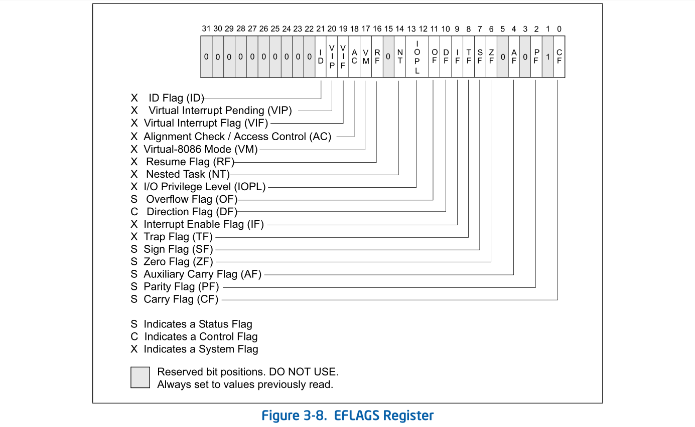

#### 寄存器

* AX --- accumulator, 累加寄存器
* CX --- counter，计数寄存器
* DX --- data，数据寄存器
* BX --- base，基址寄存器
* SP --- stack pointer，栈指针寄存器
* BP --- base pointer，基址指针寄存器
* SI --- source index，源变址寄存器
* DI --- destination index，目的变址寄存器

这些寄存器都是16位寄存器。

CPU 中还有8个8位寄存器

* AL ---- 累加寄存器低位 (accumulator low)
* CL ---- 计数寄存器低位 (accumulator low)
* DL ---- 数据寄存器低位 (data low)
* BL ---- 基址寄存器低位 (base low)
* AH ---- 累加寄存器高位 (accumulator high)
* CH ---- 计数寄存器高位 (accumulator high)
* DH ---- 数据寄存器高位 (data high)
* BH ---- 基址寄存器高位 (base high)

段寄存器

* ES ---- 附加段寄存器 (extra segment)
* CS ---- 代码段寄存器 (code segment)
* SS ---- 栈段寄存器 (stack segment)
* DS ---- 数据段寄存器 (data segment)
* FS ---- 没有名字 (segment part 2)
* GS ---- 没有名字 (segment part 3)

任务寄存器

* TR ---- 任务寄存器 (task register)

标志寄存器

* EFLAGS --- 

